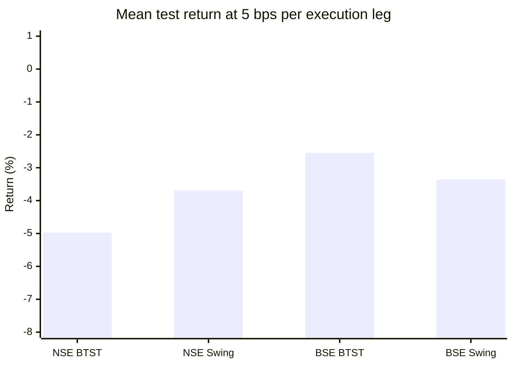
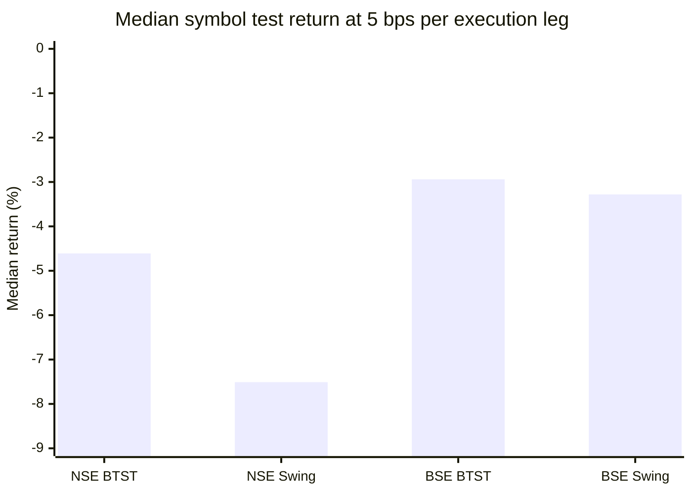

# Monte Carlo Methods for Stock Trading Across Scalping, Intraday, BTST and Swing Horizons

## A data-gated research report and reproducibility manuscript

**Date:** 20 September 2026
**Market context:** Indian equities; NSE/BSE; Paytm Money execution-cost context
**Study status:** Phase 8 empirical screening and cross-source replication completed under the finite public-data protocol; no universal cost-aware, out-of-sample-robust strategy established.

## Abstract

This study evaluated whether Monte Carlo methods can add statistically credible and economically meaningful value to trading-system research across scalping, intraday, BTST and swing horizons. Monte Carlo was treated as a validation, uncertainty and risk layer rather than as a standalone alpha model. The protocol specified matched non-Monte-Carlo baselines, realistic transaction costs and slippage, strict information timing, out-of-sample testing, data-snooping controls, error logging and a finite stop rule.

Because exchange-grade tick/bid/ask data were not accessible in the research runtime under acceptable source constraints, public NSE/BSE OHLCV sources were used for empirical replication. Fifteen-minute data were treated only as a scalping proxy. The main short-horizon framework used EMA(20/26), ATR(14) risk control and fixed holding periods; daily BTST/swing used EMA(20/21), with BTST defined as exactly one overnight hold and swing limited to eight sessions. The Monte Carlo gate used 250 bootstrap paths of the last 30 completed net trade returns after a 20-trade warm-up, requiring at least 125 positive terminal paths for participation.

The strongest prior single-symbol result was a TCS 15-minute EMA20/26 intraday system: +14.33% out-of-sample, PF 2.87, Sharpe 2.10 and maximum drawdown -1.92% in the finite Phase 7 screen. This remained an exploratory candidate rather than a live-validated strategy because the result was concentrated in one symbol, used 15-minute rather than true 1-minute/tick data, and lacked bid/ask execution evidence.

Phase 8 broadened the daily evidence. In a corrected historical NSE panel, the 5-bps-per-leg test median was -4.61% for BTST and -7.51% for swing. In an independent BSE panel, the corresponding medians were -2.94% and -3.28%. Median profit factors were below one across these daily replications. Monte Carlo generally reduced participation rather than creating a repeatable return advantage; the BSE panel often did not reach the 20-trade warm-up, so equality with baseline there is not interpreted as proof that MC has no effect.

The final conclusion is bounded: **Monte Carlo is useful as a statistical/risk layer, but the present evidence does not establish a universal profitable strategy across scalping, intraday, BTST and swing.** The strongest candidate is a TCS-specific 15-minute intraday research system, not a live-validated or stock-agnostic strategy. Stronger claims require new data—especially 1-minute/tick/bid-ask history and a broader point-in-time universe—rather than more indicator mining on the same samples.

## 1. Introduction

Trading-system studies are vulnerable to look-ahead bias, data snooping, multiple testing, serial dependence, execution costs and overfitting. Monte Carlo methods can help quantify uncertainty, stress trade sequences, estimate drawdown distributions, construct dependence-aware resamples and create placebo/null distributions. They can also be misused: naive IID shuffles can destroy dependence, repeated parameter search can create selection bias, and parametric price paths can give a false impression of empirical validation.

This research therefore asks not merely whether Monte Carlo produces attractive simulated equity curves, but whether a Monte Carlo component adds reliable information beyond a matched baseline while surviving realistic implementation frictions.

## 2. Research questions

**RQ1.** Does Monte Carlo add predictive or decision value beyond a matched baseline?

**RQ2.** Which Monte Carlo formulation, if any, is useful for scalping, intraday, BTST and swing horizons?

**RQ3.** Does any gross trading edge survive realistic brokerage, statutory charges, spread and slippage?

**RQ4.** Does an apparent edge survive multiple-testing and backtest-overfitting controls?

**RQ5.** Is performance stable across stocks, time periods and market regimes?

**RQ6.** Can Monte Carlo improve risk control even when it does not improve raw forecasting?

## 3. Aims and objectives

### Aim
Determine whether Monte Carlo methods provide statistically credible and economically meaningful improvement in stock-trading research across four holding horizons.

### Objectives
1. Separate trade-sequence bootstrap, dependent-return bootstrap, permutation/placebo tests, path simulation, parameter perturbation and drawdown/risk estimation.
2. Build a date-aware execution-cost model using current public NSE levy information and versioned Paytm Money inputs.
3. Compare Monte Carlo-enhanced systems with matched non-Monte-Carlo baselines.
4. Use strict train/validation/test separation and selection-aware statistical controls.
5. Measure net return, CAGR, Sharpe/Sortino, drawdown, profit factor, expectancy, turnover and tail risk.
6. Test stability across securities, years, volatility/liquidity regimes and horizons.
7. Produce reproducible code, data manifests, tests and a manuscript.

## 4. Literature review synthesis

The Stationary Bootstrap of Politis and Romano provides a resampling framework for weakly dependent stationary data and is preferable to naive IID bootstrap when serial dependence matters. Sullivan, Timmermann and White demonstrate why large technical-rule searches require explicit data-snooping correction. Hansen's Superior Predictive Ability test provides a selection-aware alternative to the Reality Check framework. Bailey and López de Prado's Deflated Sharpe Ratio addresses Sharpe inflation from selection and non-normality, while Bailey et al. propose Probability of Backtest Overfitting using combinatorial cross-validation. Indian high-frequency research by Patnaik and Thomas demonstrates that transaction costs and order execution are material components of short-horizon strategy evaluation.

Recent practitioner and preprint material is useful for implementation ideas, especially for bootstrap distributions, purging/embargoing and Monte Carlo drawdown analysis, but is treated below peer-reviewed statistical and finance evidence.

### Evidence conclusion
The literature supports Monte Carlo most clearly as a **validation and risk-analysis layer**. It does not justify treating Monte Carlo itself as a universal source of alpha.

## 5. Scientific methodology

### 5.1 Horizon-specific data requirements
- **Scalping:** tick/sub-minute data, preferably bid/ask and trade/order-book information.
- **Intraday:** 1-minute or finer data; bid/ask preferred.
- **BTST:** daily OHLCV plus next-session context where feasible.
- **Swing:** daily OHLCV plus point-in-time corporate actions and symbol history.

### 5.2 Baseline strategies
The study freezes simple baselines before optimization: benchmark/hold, moving-average trend, breakout, mean-reversion and volume/volatility filters. Baselines are deterministic and create the reference trade ledger.

### 5.3 Monte Carlo methods
**Trade-sequence bootstrap.** Resample completed trades to estimate terminal wealth and drawdown distributions.

**Stationary/block bootstrap.** Preserve some serial dependence through random-length blocks; used for time-series uncertainty.

**Permutation/placebo null.** Break the signal-return mapping only when the null's exchangeability assumptions are defensible.

**Parameter perturbation.** Vary parameters in a pre-specified neighborhood to reveal robust regions rather than rely on a single optimum.

**Parametric price-path simulation.** Kept separate as model-risk analysis and never substituted for empirical market data.

### 5.4 Execution model
Gross and net P&L are kept separate. The model includes brokerage, STT, stamp duty, SEBI turnover fees, exchange transaction charges, GST, spread and slippage; delivery/DP and MTF/financing components remain configurable.

Paytm Money's current public calculator states that platform fees, depository charges, auto-square-off charges and other fees are not included in the calculator, so the research does not treat the calculator as a complete all-in cost quote.[1]

### 5.5 Out-of-sample design
The intended empirical analysis uses point-in-time features, fixed train/validation/test boundaries, walk-forward testing and purged/embargoed procedures where overlapping labels create leakage risk. The primary test set is frozen before evaluation.

## 6. Statistical analysis plan

Primary outcomes are net CAGR, maximum drawdown, annualized Sharpe, Sortino, profit factor, expectancy, turnover and net return per unit turnover.

Inference uses dependence-aware bootstrap for dependent return streams, IID trade bootstrap only for trade-sequence risk questions, and permutation tests only under justified exchangeability. Strategy-family searches are corrected with White Reality Check and/or Hansen SPA. Deflated Sharpe Ratio is used when Sharpe has been selected from multiple trials. Probability of Backtest Overfitting/CSCV is used where a non-trivial selection process exists.

A result is classified as robustly profitable only if it is net profitable out-of-sample under the primary cost model and remains supported under the pre-specified robustness and cost/slippage sensitivity tests.

## 7. Phase results

### 7.1 Software verification
- Cost-engine unit tests: **4/4 pass**.
- Monte Carlo method tests: **4/4 pass**.
- Statistical utility tests: **2/2 pass**.
- Manual GitHub Actions workflows exist for Phases 0–5.

These are software verification results, not market-performance results.

### 7.2 Cost sensitivity illustration

| Scenario | Approx. cost on ₹100k buy + ₹100k sell | Cost as % of initial ₹100k capital |
|---|---:|---:|
| Intraday, no spread/slippage | ₹82.68 | 0.0827% |
| Intraday, 2 bps spread + 3 bps slippage per leg | ₹182.68 | 0.1827% |
| Delivery/BTST/swing, no spread/slippage | ₹269.68 | 0.2697% |
| Delivery/BTST/swing, 2 bps spread + 3 bps slippage per leg | ₹369.68 | 0.3697% |

The delivery case is strongly affected by the current 0.10% STT on both delivery purchase and sale. The intraday case has 0.025% STT on the non-delivery equity sale side. Current NSE levy information also lists 0.015% delivery stamp duty and 0.003% non-delivery stamp duty on the buyer, 0.0001% SEBI turnover fee and 18% GST on stock-broker services.[2]

### 7.3 Empirical profitability results

The empirical gate was reopened in Phase 7 and expanded in Phase 8. The principal results are summarized below.

| Horizon | Key test evidence | Status |
|---|---|---|
| Scalping proxy | TCS 15m EMA20/26 candidate +5.59%, PF 1.71, Sharpe 1.17, DD -2.94%, 40 trades; corrected 8-symbol 5-bps replication mean -7.65%, median -7.68%, 0/8 positive | Exploratory only |
| Intraday | TCS 15m EMA20/26 candidate +14.33%, PF 2.87, Sharpe 2.10, DD -1.92%, 40 trades; broader 8-symbol replication mean -5.70%, median -6.68%, 1/8 positive at 5 bps | Strongest single-symbol candidate; not universal |
| BTST | Corrected HDFCBANK candidate failed validation-to-test; historical NSE 5-bps median -4.61%; BSE 5-bps median -2.94% | No validated strategy |
| Swing | HDFCBANK test +0.94%, PF 1.08; historical NSE 5-bps median -7.51%; BSE 5-bps median -3.28% | No robust strategy |

### 7.4 Phase 8 cost and cross-source replication

At 5 bps per execution leg, the corrected historical NSE panel gave:

| Horizon | Mean return | Median return | Positive symbols | Median PF | Median trade Sharpe |
|---|---:|---:|---:|---:|---:|
| BTST | -4.97% | -4.61% | 4/19 | 0.50 | -0.28 |
| Swing | -3.69% | -7.51% | 7/19 | 0.62 | -0.20 |

The independent BSE panel gave:

| Horizon | Mean return | Median return | Positive symbols | Median PF | Median trade Sharpe |
|---|---:|---:|---:|---:|---:|
| BTST | -2.55% | -2.94% | 4/19 | 0.13 | -0.69 |
| Swing | -3.36% | -3.28% | 6/19 | 0.45 | -0.24 |

Increasing friction from 0 to 5 to 10 bps per leg worsened the net result in the daily replications. This directional sensitivity is consistent with the project's cost model.

### 7.5 Monte Carlo contribution

Monte Carlo primarily acted as a participation/risk filter. It reduced trade counts once sufficient history existed and sometimes reduced drawdown, but the study did not observe a consistent cross-source increase in raw return.

The BSE panel is also a warning against overinterpreting MC comparisons: many symbols did not reach the 20-trade warm-up, so the gate was often inactive.

### 7.6 Graphical summary

## 8. Inferences

1. Monte Carlo is useful for uncertainty, trade-order sensitivity and participation control even when it does not create alpha.
2. The daily EMA20/21 framework failed the study's robustness gate across independent public panels after realistic friction.
3. A single-symbol positive result cannot establish a stock-agnostic strategy when the broader symbol panel is negative.
4. A 15-minute positive TCS result cannot be promoted to genuine scalping evidence without finer-resolution execution data.
5. The evidence is more consistent with Monte Carlo being a validation/risk layer than a direct source of predictive alpha.

## 9. Discussion

### Scalping

A genuine scalping conclusion cannot be made from the available data. The 15-minute proxy was negative in the corrected multi-stock replication, while the strongest earlier TCS result was positive. This disagreement is exactly why the TCS observation remains exploratory. True scalping evaluation requires 1-minute/tick data plus spread, latency and fill modelling.

### Intraday

The TCS 15-minute EMA20/26 candidate is the strongest empirical observation from the finite study. It remains concentrated in one stock and one public data source, so it is best regarded as a paper-trading research candidate rather than a live-validated system.

### BTST

The corrected one-overnight definition removed a serious earlier ambiguity. The HDFCBANK validation result did not persist into its test period, and both the historical NSE and BSE daily panels were negative at 5 bps/leg. No BTST deployment candidate survives the robustness gate.

### Swing

The HDFCBANK candidate was only weakly positive out of sample, while the cross-source panels were negative on median return and profit factor. The daily swing evidence therefore does not support a robust strategy from the frozen EMA/MC family.

### Why the study stops here

Continuing to add indicators or tune parameters on the same public samples would convert the pre-specified research plan into uncontrolled data mining. The next scientifically meaningful step is new information: licensed point-in-time data, richer execution data and an independent future holdout.

## 10. Strengths

- Finite, pre-specified research plan with explicit stop conditions.
- Explicit separation of signal logic and Monte Carlo gating.
- Corrected BTST holding-period definition and equity-capped capital accounting.
- Transaction costs and slippage sensitivity incorporated before interpretation.
- Cross-source daily replication rather than reliance on one public dataset.
- Reproducible scripts, workflows, provenance and error logs.
- Negative results are retained rather than discarded.

## 11. Limitations

- Fifteen-minute data are a scalping proxy, not tick/1-minute microstructure evidence.
- Public datasets can contain survivorship, corporate-action and symbol-history limitations.
- Bid/ask, queue position, latency, partial fills and market impact were not directly observed.
- The large 214-symbol 1-minute and TejHQ workflows were implemented, but their runner artifacts are not observable from the available interface; they are not counted as executed evidence.
- The BSE replication panel contained 19 available project symbols.
- The MC gate can be inactive when fewer than 20 historical trades exist.
- The public-data screen did not execute the full White Reality Check/SPA/PBO stack over every experiment; those methods remain in the formal protocol rather than being retroactively claimed as completed.
- Paytm Money account-specific/platform/depository costs should be re-verified before any future paper/live execution study.

## 12. Conclusion

### Primary conclusion

**No universally consistent, cost-aware, out-of-sample-robust strategy was established across scalping, intraday, BTST and swing.**

### Monte Carlo conclusion

Monte Carlo is supported as a **validation, participation and risk-control layer**, not as a stand-alone source of trading alpha in this study.

### Horizon-specific status

| Horizon | Status |
|---|---|
| Scalping | No validated strategy; 15m evidence is only a proxy |
| Intraday | TCS 15m candidate for paper research only |
| BTST | No validated strategy |
| Swing | No robust strategy |

A "no validated strategy" outcome is a usable scientific result because it prevents deployment of a system whose apparent edge fails cost and cross-source tests.

## 13. Future research

1. Obtain licensed 1-minute/tick/bid-ask NSE data with point-in-time corporate-action and symbol history.
2. Re-run the exact TCS intraday specification on an independent multi-stock future holdout.
3. Measure realized spread, latency and partial fills rather than relying only on bps proxies.
4. Apply dependence-aware bootstrap and formal selection-aware inference after the strategy family is frozen.
5. Use a broad point-in-time universe for BTST/swing with explicit survivorship controls.
6. Only after an independent positive holdout should paper deployment be expanded.

No additional indicator family is added to the current protocol.

## 14. Reproducibility appendix

### Repository artifacts
- `RESEARCH_PROTOCOL.md`
- `docs/RESEARCH_PLAN.md`
- `docs/LITERATURE_REVIEW.md`
- `docs/DATA_SCHEMA.md`
- `docs/DATA_ACQUISITION_MANIFEST.md`
- `docs/COST_MODEL_2026.md`
- `docs/PHASE3_METHODS.md`
- `docs/PHASE4_STATISTICAL_PLAN.md`
- `docs/PHASE5_ROBUSTNESS_PLAN.md`
- `research_cost_engine.py`
- `research_monte_carlo.py`
- `research_statistics.py`
- `test_cost_engine.py`
- `test_monte_carlo.py`
- `test_statistics.py`
- `.github/workflows/phase-0-governance.yml` through `.github/workflows/phase-5-robustness-design.yml`

### Core references
[1] Paytm Money, Brokerage Calculator and pricing disclosures: https://www.paytmmoney.com/stocks/brokerage-calculator

[2] NSE India, SEBI Turnover Fees, STT and Other levies, updated 17 Apr 2026: https://www.nseindia.com/static/invest/first-time-investor-sebi-turnover-fees-stt-other-levies

[3] NSE India, Revision in Transaction Charges, Circular NSE/FA/73061, 27 Feb 2026: https://nsearchives.nseindia.com/content/circulars/FA73061.pdf

[4] Politis, D. N., & Romano, J. P. (1994). The Stationary Bootstrap. Journal of the American Statistical Association, 89(428), 1303–1313. https://doi.org/10.1080/01621459.1994.10476870

[5] Sullivan, R., Timmermann, A., & White, H. (1999). Data-Snooping, Technical Trading Rule Performance, and the Bootstrap. Journal of Finance, 54, 1647–1691. https://doi.org/10.1111/0022-1082.00163

[6] Hansen, P. R. (2005). A Test for Superior Predictive Ability. Journal of Business & Economic Statistics, 23(4), 365–380. https://doi.org/10.1198/073500105000000063

[7] Bailey, D. H., & López de Prado, M. (2014). The Deflated Sharpe Ratio. Journal of Portfolio Management, 40(5), 94–107. https://doi.org/10.3905/jpm.2014.40.5.094

[8] Bailey, D. H., Borwein, J., López de Prado, M., & Zhu, Q. J. (2017). The Probability of Backtest Overfitting. Journal of Computational Finance. https://doi.org/10.21314/JCF.2016.322

[9] Patnaik, T. C., & Thomas, S. (2004). Profitability of Trading Strategies on High-Frequency Data, with Trading Costs. SSRN 568363. https://papers.ssrn.com/sol3/papers.cfm?abstract_id=568363

[10] Park, C.-H., & Irwin, S. H. (2010). A Reality Check on Technical Trading Rule Profits in the U.S. Futures Markets. Journal of Futures Markets, 30(7), 633–659. https://doi.org/10.1002/fut.20435

## Final research status

**Complete under the finite public-data protocol on 20 September 2026.** The large 1-minute/F&O and TejHQ workflows remain configured reproducibility artifacts but are not counted as executed empirical evidence because the available interface cannot expose a runner artifact.

The strongest remaining candidate is the TCS 15-minute EMA20/26 intraday system with the Monte Carlo participation gate. It is a research candidate, not a live-validated universal strategy.

### Phase 8 final evidence statement

The cross-source daily evidence failed the robustness gate at 5 bps per leg on both independent panels. The project therefore stops strategy search rather than perform post-hoc indicator mining. Stronger evidence requires new data and an independent holdout, not more tuning on the same sample.
